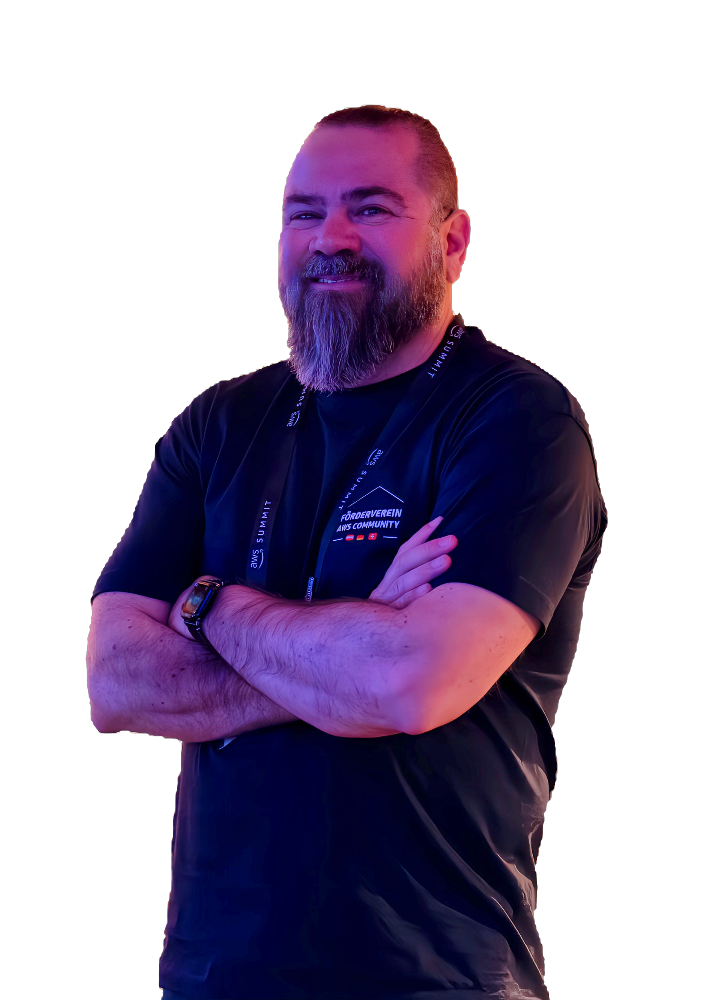

# Hi there 👋

I'm Gustavo, here are some highlights of my code career.

- I started around 1996, developing a Visual Basic with MS Access Networked Application.
- I worked as DBA of the first Multi-Master Oracle Database-based Application in Brazil.
- I connected a Lotus Notes/Domino application on Win to a Mainframe DB2 database using SNA Server.
- I worked as a Quality System Administrator in a CMMi level 5 company in Brazil.
- I worked implementing an IT Outsource for a global Bank (+12 countries).
- I worked in defining and managing ITIL processes for one of the biggest Brazilian Telecoms and a medium Brazilian Commercial Bank.
- I directed the IT department of the Brazilian Paralympics Sports Organization.
- I developed a microservice application using SOAP as an integration model 😱.
- I worked consulting for multiple Brazilian Federal Government Agencies (Health, Justice, Electoral High Court, and Legislative Chamber).
- I used the first _Serverless_ framework that was created for AWS: [JAWS](https://aws.amazon.com/blogs/compute/getting-started-with-jaws-on-amazon-web-services/).
- I put two full _Serverless_ applications in production (one webshop and one Enterprise Application).
- I'm an [AWS Community Builder](https://aws.amazon.com/developer/community/community-builders/)

## Social Presence

- You can find more details about my career, like education, certifications, and organizations, in my [LinkedIn](https://www.linkedin.com/in/gustavares/) profile.
- You can find some code that I shared in my [GitHub Profile](https://github.com/grstavares).
- Occasionally, I try to answer some questions in [Stack Overflow](https://stackoverflow.com/users/6471284/gustavo-tavares).
- I'm not active there, but in the past, I retweeted things mostly related to Serverless, Brazilian Politics, European Politics, and random jokes and memes at [@grstavares](https://twitter.com/grstavares).
- You can also find me at BlueSky [@grstavares.bsky.social](https://bsky.app/profile/grstavares.bsky.social).
- My most active social network is [Untapped](https://untappd.com/user/grstavares).
- I'm part of the [Förderverein AWS Community DACH](https://www.linkedin.com/company/aws-community-dach/), helping organize the Community Lounge at the AWS Summit Germany and the AWS Community Day DACH.
